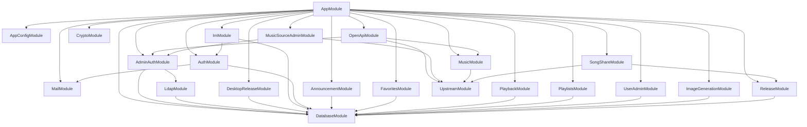
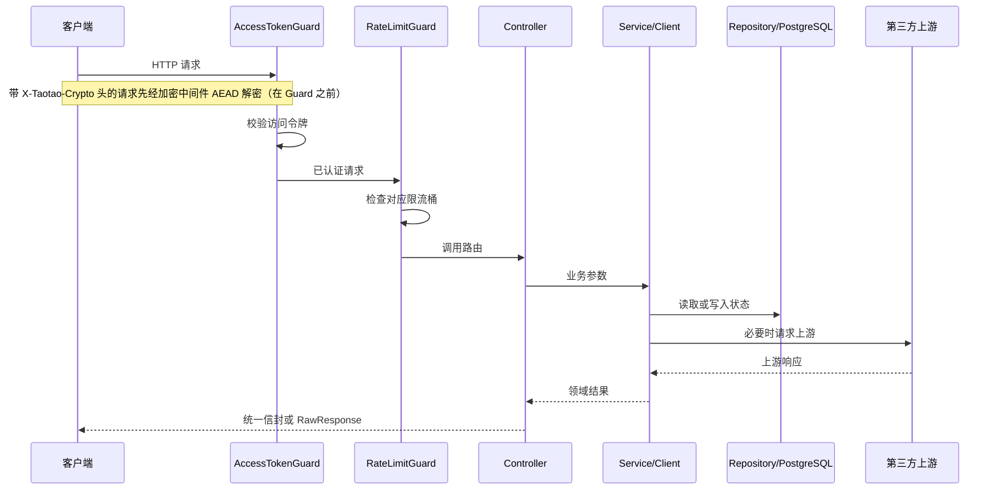

# 后端架构

[返回文档中心](README.md)

## 1. 服务边界

桃桃音乐后端是 NestJS + TypeScript 接口适配服务，负责业务鉴权、传输层加密、上游协议收敛、状态持久化、Android 热更新、Windows 桌面模块更新和悟空 IM 业务代理。

服务负责：

- 用户注册、登录、访问令牌和刷新令牌轮换。
- 收藏数据持久化。
- 用户云端歌单、歌曲快照与顺序持久化。
- 收藏、最近播放、听歌统计、单曲倒带日记和歌曲分享短链。
- 多音源（腾讯/网易/酷我、波点）音乐搜索、歌曲信息、播放链接和歌词适配。
- 音源账号（酷我/波点）后台管理与短信登录，凭据只进不出。
- APK 登记、灰度、下载、最低版本和远程配置。
- Windows 模块清单、内容寻址文件、差分和灰度发布。
- ApiSweet `gpt-image-2` 任务创建、Key 配额与状态轮询。
- 传输层加密：握手、AEAD 逐块加解密（协议 v2，握手密钥绑定设备号；未配置 PSK 时明文降级）。
- 悟空 IM 会话凭据、联系人、会话/频道同步、撤回和已读代理。
- 公告、后台用户管理、邮箱验证码和头像上传。
- 面向第三方的开放搜歌 API 与密钥管理。
- 管理后台账号、数据库会话、TOTP 双因素、角色权限、IP 白名单和操作审计。
- LDAP/SSO 目录对接与角色映射（可选，未配置时只用本地管理员账号）。

服务不负责：

- 长期保存音频、歌词、封面或生成图片文件（分享试听缓存和发布对象目录是受控例外）。
- 把第三方 API Key 下发给客户端。
- 在数据库中保存访问令牌明文或刷新令牌明文。
- 在服务端长期缓存上游限时播放链接。

## 2. 模块依赖



`AppConfigModule`、`DatabaseModule` 和 `MailModule` 是全局模块。业务模块可以直接注入
`AppConfigService`、`DatabaseService` 和 `MailService`，不需要重复导入。

`AdminAuthModule` 与 `LdapModule` 互相依赖（LDAP 登录成功要同步管理员行，认证模块要用 LDAP
校验口令），因此两边都用 `forwardRef()` 打破循环。它们**不是全局模块**：任何模块只要用到
`AdminAuthGuard` 或 `RolesGuard`，都必须显式 `imports: [AdminAuthModule]`，否则启动即失败。

## 3. 源码职责

```text
src/
├─ main.ts
├─ app.module.ts
├─ auth/
├─ common/
│  ├─ decorators/
│  ├─ filters/
│  ├─ interceptors/
│  └─ rate-limit/
├─ config/
├─ database/
├─ announcement/
├─ favorites/
├─ playback/
├─ playlists/
├─ health/
├─ crypto/
├─ image-generation/
├─ music/
├─ open-api/
├─ release/
├─ desktop-release/
├─ im/
├─ mail/
├─ shares/
├─ user-admin/
├─ admin-auth/
├─ ldap/
├─ frontend/
└─ upstream/
```

### `main.ts`

- 关闭 NestJS 默认 body parser。
- 挂载传输加密中间件（`crypto.middleware.ts`）：**必须先于 body parser**，带 `X-Taotao-Crypto`
  头的请求按 AAD（method+path+query）逐块 AEAD 解密出原始字节，无加密头的请求完全透明。
  `RAW_BODY_PATHS` 白名单与 `*/play` 音频流不参与解密。
- 对 APK、Android 补丁和桌面 artifact 原始字节上传路由跳过 JSON 解析。
- 普通路由挂载 16KB JSON parser，桌面发布清单单独使用 1MB parser。
- 注册全局 `ValidationPipe`。
- 设置 `/api/v1` 前缀，并排除 `/health`。

修改 body parser 时必须保留 APK 上传例外，否则大文件会被缓存在内存中或直接返回 413；调整中间件挂载顺序时，加密解密必须保持在 body parser 之前。

### `app.module.ts`

- 聚合业务模块。
- 注册访问令牌守卫和限流守卫。
- 注册安全响应头、最新版本号和成功信封拦截器。
- 注册统一异常过滤器。

全局 Provider 的注册顺序会影响请求行为，调整前必须执行完整契约验证。

### `common/`

这里放跨业务基础设施，不放具体业务规则：

- `ApiException` 和稳定业务码。
- `@Public()`、`@RawResponse()`、`@RateLimit()`、`@CurrentUser()`。
- 全局访问控制、限流、响应信封和错误过滤。
- 并发信号量等通用工具。

### `upstream/`

第三方接口的不一致统一在这里收敛。各音源（腾讯/网易/酷我/波点）的成功码、字段名、音质阶梯和歌词格式不能散落到 Controller；`music-source.registry.ts` 按注册表分派，音源账号凭据由 `music-source-account.repository.ts` 管理（token 只写不读），后台接口在 `music-source-admin.controller.ts`。

### `crypto/`

传输层加密：`crypto.controller.ts` 暴露公开握手 `POST /crypto/handshake`；`crypto.middleware.ts` 在 body parser 之前做 AEAD 解密；`crypto-transport.service.ts` 在 `onApplicationBootstrap` 加载 `crypto/dist` 的原生产物（协议版本须 ≥2）、登记 PSK 并启动每分钟的过期会话清理；`native-loader.ts` 负责跨平台产物查找，缺失时只 WARN 并降级为明文链路。

### `image-generation/`

- `image-generation.controller.ts`：HTTP 参数与路由。
- `image-generation.client.ts`：ApiSweet 请求和响应映射。
- `api-key.repository.ts`：Key 池选择、原子扣额和退款。
- `image-task.repository.ts`：任务、提示词、状态和图片地址持久化。
- `dto/`：创建任务的输入校验。

### 其它业务模块的边界

- `auth/` 只负责身份和资料；邮箱发信由 `mail/` 承担，头像文件由 Lsky 处理，不能把 SMTP 或图床调用散到页面 Controller。
- `favorites/` 保存收藏状态机；搜索只通过 Repository 批量查询，不为每首歌单独请求收藏接口。
- `playback/` 把会话快照、最近播放可见代际和累计统计分开，清空操作不删除统计。
- `playlists/` 的所有顺序/完整替换操作在事务内锁定歌单，`source + songId` 是歌曲身份，展示字段只是快照。
- `release/` 与 `desktop-release/` 各自拥有版本、文件和最低版本语义；桌面端使用内容寻址对象，不能复用 APK 文件名逻辑。
- `im/` 只代理悟空 IM 的凭据和同步命令；聊天正文、频道游标不进入 PostgreSQL。
- 下面 5 个控制器都挂 `@AdminGuarded()`（= `AdminAuthGuard` + `RolesGuard`，只认管理员会话
  `Authorization: Bearer`），不要误加普通访问令牌依赖：
  `announcement.controller.ts`（只保护 `/app/admin/*` 那几个方法，公开的 `GET /announcements` 不能加）、
  `release/release-admin.controller.ts`、`desktop-release/desktop-release-admin.controller.ts`、
  `user-admin/user-admin.controller.ts`、`image-generation/image-key-admin.controller.ts`。
  **五个控制器一律逐方法挂，没有例外**：类级 `@UseGuards` 会在将来新增公开路由时静默拦下它，
  且漏标一个方法就等于那条路由裸奔。见 `admin-auth/admin-guarded.decorator.ts`。
  写操作标 `@RequireRole(...WRITE_ROLES)` 并调 `AdminAuditService` 留痕；读操作标 `@RequireRole(...READ_ROLES)`，
  **但返回个人数据的读接口要用 `PRIVILEGED_READ_ROLES`** —— 目前是 `user-admin` 的两个读接口
  （`email` 与逐首歌的听歌历史）和音源账号清单（凭据属个人信息），观察者看不到。改这类接口要同时改 `App.vue` 的页签可见性。
- `admin-auth/` 拥有管理后台的身份与权限：账号、会话、2FA、角色守卫、IP 白名单和审计。它对外只暴露 `AdminAuthGuard` 与角色常量（`admin-roles.ts`），并提供 `AdminAuditService` 给业务控制器写审计，其它模块不应自己实现管理员鉴权。
- `ldap/` 只做目录协议（Bind、Search、过滤器编解码）和角色映射，不直接签发会话；`authenticate()` 返回 `success`/`denied`/`skipped` 三态，由 `admin-auth/` 决定是否回落本地口令。

管理后台的完整链路、2FA 两步流程和启动期硬约束见 [11-admin-auth.md](11-admin-auth.md)。

## 4. 普通请求链路



公开路由也会尝试解析访问令牌，但令牌无效时继续放行。`/app/bootstrap` 利用这个行为：有效令牌按用户灰度，无效令牌退回设备号，绝不能返回 401。

## 5. 依赖注入规则

- Controller 只注入 Service、Client 或 Repository，不读取 `process.env`。
- 环境变量统一由 `AppConfigService` 暴露为类型化字段。
- SQL 只写在 Repository 或数据库迁移中。
- 上游协议解析只写在对应 Client。
- 不在构造函数中执行数据库查询；NestJS 实例化 Provider 时迁移可能尚未完成。
- 守卫的依赖在**声明 Controller 的模块**里解析，不是提供守卫的模块。引用 `AdminAuthGuard` 或
  `RolesGuard` 的模块必须自己 `imports: [AdminAuthModule]`，否则启动报 `UnknownDependenciesException`。
- `@UseGuards` 挂在类上会作用于该 Controller 的**所有**方法。同一个控制器里既有公开方法又有
  受保护方法时（例如 `admin/auth` 的 `login` 和 `me`），必须用方法级装饰器，不能图省事提到类上。

## 6. 状态与并发

### 数据库连接

连接池上限为 10。不能跨上游 HTTP 请求持有 `pool.connect()` 得到的连接，否则慢上游会耗尽连接池。

`DatabaseService` 只暴露：

- `first`：取第一行。
- `all`：取多行。
- `run`：执行写操作并返回影响行数。
- `transaction`：在同一连接上执行带提交/回滚的事务回调；歌单排序、发布清单替换和需要行锁的多步写入必须使用它。
- `ping`：健康探测。

### 进程内状态

限流计数器和最新全量版本号缓存位于进程内：

- 重启即清空。
- 多实例不共享。
- 多实例部署时不能把它们当作全局一致状态。

### 需要原子 SQL 的路径

- 刷新令牌消费：单条 `UPDATE ... RETURNING`。
- 图片 Key 配额：锁定候选 Key 后单条 `UPDATE ... RETURNING`。
- 并发注册：依赖数据库唯一约束兜底。
- 发布版本登记：依赖 `ON CONFLICT DO UPDATE`。
- 播放清空 marker：在 `playback_history_clear_operation` 的主键冲突上保持幂等。
- 公告置顶：使用独立顾问锁串行化“取消旧置顶 + 设置新置顶”。

这些路径不能拆成“先 SELECT、再 UPDATE”。

## 7. 架构修改检查表

- 新路由是否默认鉴权，公开路由是否显式 `@Public()`？
- 控制器里既有公开又有受保护方法时，是否用了方法级守卫而不是类级 `@UseGuards`？
- 用到 `AdminAuthGuard` / `RolesGuard` / `AdminAuditService` 的模块是否导入了 `AdminAuthModule`？
- 新增的管理接口是否标了 `@RequireRole`（漏标 = 放行，不报错）？写操作是否调了 `AdminAuditService`？
- 需要写表的初始化是否放在 `onApplicationBootstrap`，而不是 `main.ts` 或构造函数？
- 是否误给流式接口套了成功信封？
- 是否把上游 401 直接透传给客户端？
- 是否跨网络请求持有数据库连接？
- 是否复制了已有 Client、Repository 或错误映射逻辑？
- 是否更新对应专题文档？
- 是否完成生产构建，并让契约脚本全部通过？

## 8. 应用启动生命周期

启动不是“加载模块后立即监听端口”，实际顺序如下：

```text
读取 .env / 系统环境变量
  → validateEnvironment 校验端口、AUTH_SECRET、DATABASE_URL
  → NestFactory.create(AppModule)：实例化 Module 和 Provider（构造函数在这里跑）
  → 挂载按路由分流的 JSON parser（普通 16KB、桌面清单 1MB、原始上传跳过）
  → 挂载 /admin 与 /share 静态资源
  → setGlobalPrefix("api/v1", exclude: ["health"])
  → 注册全局 ValidationPipe
  → app.listen(PORT)
      ├─ app.init()
      │    ├─ onModuleInit：DatabaseService 等待 PostgreSQL → 顾问锁 → 幂等 DDL
      │    └─ onApplicationBootstrap：AdminBootstrapService 创建默认管理员；
      │         CryptoTransportService 加载加密原生产物（协议 ≥2）、登记 PSK、启动会话清理定时器
      └─ 端口开始接受连接
```

关键点是 `main.ts` 的顶层代码、`onModuleInit`、`onApplicationBootstrap` 是三个不同的时间点：
建表在 `onModuleInit`，所以 `main.ts` 里能跑代码时**表还不存在**。任何需要写表的初始化都必须
放在 `onApplicationBootstrap`（默认管理员就是这么修的）。

几个容易误判的点：

- Provider 构造函数发生在数据库迁移之前，所以不能在构造函数查询表。
- “Module dependencies initialized”不表示数据库已经就绪；要等“数据库已就绪”。
- 默认管理员如果写在 `main.ts`，会早于迁移执行，必然报“关系 admin_users 不存在”。
- 数据库连接重试全部失败时，服务会退出，不会继续提供残缺接口。
- 端口只有在迁移完成后才开始监听，因此健康检查成功意味着表结构也已初始化。

## 9. 响应阶段顺序

普通 Controller 返回领域对象后：

1. `EnvelopeInterceptor` 包装 `{code,message,data}`。
2. `LatestVersionHeaderInterceptor` 写入全量版本响应头。
3. `SecurityHeadersInterceptor` 写入安全响应头。
4. Express 序列化并发送响应。

抛出异常时由 `AllExceptionsFilter` 接管。流式接口一旦已经发送响应头，就不能再改状态码或追加 JSON 错误体，只能结束连接。因此搜索会在 `writeHead` 前完成收藏批量查询等可能失败的操作。

## 10. 外部系统边界

| 外部系统 | 本服务保存什么 | 本服务不保存什么 |
| --- | --- | --- |
| 腾讯/网易音乐接口 | 不持久化，仅做实时映射 | 音频文件、歌词文件、限时直链 |
| ApiSweet | Key、任务元数据、结果 URL | 生成图片文件 |
| PostgreSQL | 用户、令牌哈希、收藏、发布、配置、图片任务 | 用户密码明文、令牌明文 |
| APK 文件目录 | 已登记的 APK/补丁文件 | Android 构建工程状态 |
| `DESKTOP_RELEASE_DIR` | 按 sha256 命名的桌面模块和差分对象 | 桌面构建机临时目录 |
| SMTP/Lsky/悟空 IM | 仅实时调用或签发凭据 | 邮件正文、头像原图、聊天消息正文 |
| LDAP/SSO 目录 | 管理员行的同步副本（用户名、角色、显示名） | 目录口令、目录中其它用户和组的完整数据 |

外部 URL 返回客户端前要确认：

- 使用 HTTPS。
- 客户端访问时不需要桃桃音乐 Authorization。
- 不包含服务端凭据。
- 对限时地址明确生命周期，不写入长期队列或持久化状态。
