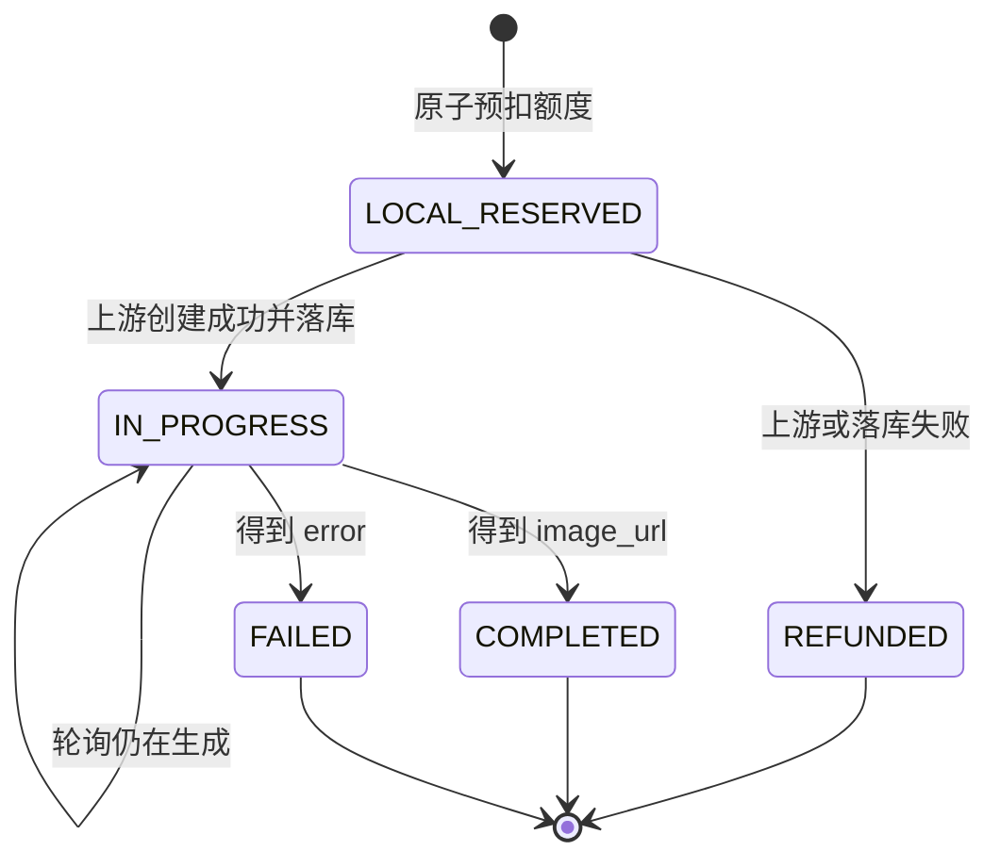

# gpt-image-2 图片生成

[返回文档中心](README.md)

## 1. 功能范围

图片模块把客户端请求适配到 ApiSweet：

```text
POST /api/v1/draw/completions
  → 校验桃桃音乐访问令牌
  → 校验 DTO
  → 从 GPTIMAGE2 Key 池原子预扣额度
  → POST https://apisweet.com/v1/draw/completions
  → 写入 image_generation_task
  → 返回 taskId

GET /api/v1/draw/result/{taskId}
  → 从任务表读取 api_key_id
  → 使用创建任务时的原 Key
  → GET https://apisweet.com/v1/draw/result/{taskId}
  → 回写状态和图片地址
  → 返回标准化结果
```

服务不下载或保存生成图片，只保存 HTTPS 图片地址。

## 2. 源码位置

| 文件 | 职责 |
| --- | --- |
| `src/image-generation/image-generation.controller.ts` | 创建和查询路由 |
| `src/image-generation/image-generation.client.ts` | ApiSweet 请求、状态映射、错误转换 |
| `src/image-generation/api-key.repository.ts` | Key 选择、扣额、退额 |
| `src/image-generation/image-task.repository.ts` | 任务落库、Key 关联、结果回写 |
| `src/image-generation/dto/create-image.dto.ts` | 请求字段和枚举校验 |
| `src/image-generation/image-generation.module.ts` | NestJS Provider 注册 |

## 3. 配置

仅服务地址使用环境变量：

```env
APISWEET_BASE_URL=https://apisweet.com
```

API Key 只能写入 `api_key` 表，不能使用 `APISWEET_API_KEY` 环境变量。

固定渠道常量：

```text
GPTIMAGE2
```

渠道大小写必须完全一致。

图片 Key 后台接口由 `ImageKeyAdminController` 提供，逐方法挂 `@AdminGuarded()`（只认管理员会话
`Authorization: Bearer`，见 [11-admin-auth.md](11-admin-auth.md)）：

- `GET /api/v1/app/admin/image-keys`：只返回 Key ID、渠道和额度，不返回 Key 明文。
- `POST /api/v1/app/admin/image-keys`：新增或更新额度，Key 长度 8–512，额度 0–1,000,000。
- `DELETE /api/v1/app/admin/image-keys/{id}`：仍被任务引用时受数据库外键限制，返回 404/4042。

## 4. Key 池

### 字段

| 字段 | 约束 |
| --- | --- |
| `id` | identity 主键，任务通过它关联 Key |
| `channel` | 非空，当前为 `GPTIMAGE2` |
| `key` | 非空，同渠道内唯一 |
| `quota` | 非负整数 |

### 选择策略

满足 `channel = GPTIMAGE2` 且 `quota >= 本次消耗` 的记录中：

1. 额度高的优先。
2. 额度相同时 ID 小的优先。
3. 使用行锁和单条 UPDATE 扣减。

当前 `QUOTA_PER_TASK = 1`。如果以后获得不同尺寸和质量的精确计费表，应把固定值改为只依赖请求参数的纯函数，并同时记录计算后的 `consumed_quota`。

### 添加 Key

```sql
INSERT INTO api_key (channel, key, quota)
VALUES ('GPTIMAGE2', '替换为真实Key', 100)
ON CONFLICT (channel, key)
DO UPDATE SET quota = excluded.quota;
```

新增 Key 应 INSERT 新行，不要覆盖旧行的 Key 内容。旧任务通过 `api_key_id` 关联原记录，上游要求使用创建任务时的 Key 查询。

### 额度归还

以下情况归还预扣额度：

- 连接 ApiSweet 失败。
- 请求超时。
- 上游返回非成功状态。
- 上游响应无法解析。
- 上游未返回有效任务 ID 或状态。
- 本地任务记录写入失败。

额度归还失败只记录不含 Key 的错误日志，原始业务异常继续返回客户端。

## 5. 创建参数

| 字段 | 必需 | 允许值 |
| --- | --- | --- |
| `model` | 是 | `gpt-image-2` |
| `prompt` | 是 | 非空字符串 |
| `images` | 否 | 最多 8 个 HTTP/HTTPS URL |
| `aspectRatio` | 否 | `1:1`、`4:3`、`3:4`、`16:9`、`9:16`、`3:2`、`2:3`、`2:1`、`1:2` |
| `imageSize` | 否 | `1K`、`2K`、`4K` |
| `quality` | 否 | `low`、`medium`、`high` |

服务重新构造上游请求体，不会把客户端提供的未知字段透传给 ApiSweet。

## 6. 任务持久化

上游创建成功后写入：

```text
task_id         上游 task_id
prompt          去除首尾空白后的提示词
consumed_quota  本次实际预扣额度
channel         GPTIMAGE2
state           IN_PROGRESS
completed       0
image_url       NULL
api_key_id      本次使用的 Key 主键
```

状态查询后更新：

| 上游状态 | `state` | `completed` | `image_url` |
| --- | --- | --- | --- |
| `IN_PROGRESS` | `IN_PROGRESS` | 0 | NULL |
| `COMPLETED` | `COMPLETED` | 1 | 上游图片 HTTPS URL |
| `FAILED` | `FAILED` | 1 | NULL |

`completed` 表示进入终态，不等同于生成成功；成功与失败必须看 `state`。

当前 `image_generation_task` 没有 `user_id` 字段。创建和轮询接口仍要求桃桃访问令牌，但只要知道
合法 `taskId`，任意已登录用户都可能查询该任务；这不是任务归属隔离。若产品需要隔离，必须先在
迁移中新增用户外键，并在创建和查询两条路径同时校验。

## 7. 轮询策略

客户端建议：

1. 创建成功后等待约 3 秒。
2. 调用 `/draw/result/{taskId}`。
3. `IN_PROGRESS` 再等待约 3 秒。
4. `COMPLETED` 展示 `result.imageUrl`。
5. `FAILED` 展示 `error.message`。
6. 客户端应设置总超时或最大轮询次数，避免无限轮询。

轮询按用户 300 次、来源地址 1800 次/15 分钟独立限流，不消耗创建接口的本地额度。

## 8. 上游响应映射

### 创建成功

上游：

```json
{
  "code": 200,
  "data": {
    "task_id": "task_xxxxx",
    "status": "IN_PROGRESS"
  }
}
```

本服务：`task_id → taskId`，保留状态字符串。

### 查询成功

- `task_id → taskId`
- `created_at → createdAt`
- `completed_at → completedAt`
- `result.image_url → result.imageUrl`
- HTTP 图片地址会提升为 HTTPS。

完成态没有图片地址视为无效上游响应，返回 502。

## 9. 错误映射

| ApiSweet | 本服务 | 原因 |
| --- | --- | --- |
| 400 | 400/4007 | 客户端参数错误 |
| 401 | 502/5021 | 是后端 Key 错误，不是用户登录失效 |
| 402 | 502/5021 | 上游余额或配额问题 |
| 404 | 404/4042 | 图片任务不存在 |
| 429 | 429/4291 | 图片上游限流 |
| 500/502 | 502/5021 | 上游服务故障 |
| 本地无 Key/无额度 | 503/5032 | 服务未配置或本地额度耗尽 |

## 10. 运维查询

查看额度，不输出 Key：

```sql
SELECT id, channel, quota
FROM api_key
WHERE channel = 'GPTIMAGE2'
ORDER BY quota DESC, id;
```

查看任务状态：

```sql
SELECT task_id, consumed_quota, channel, state, completed, image_url, api_key_id
FROM image_generation_task
ORDER BY task_id
LIMIT 50;
```

按 Key 汇总任务：

```sql
SELECT api_key_id, state, count(*) AS task_count, sum(consumed_quota) AS consumed
FROM image_generation_task
GROUP BY api_key_id, state
ORDER BY api_key_id, state;
```

不要在排查输出中选择 `api_key.key`。

## 11. 修改检查表

- 是否仍按任务的 `api_key_id` 查询，而不是重新选择任意 Key？
- 扣额是否保持原子 SQL？
- 所有失败路径是否正确归还预扣额度？
- 日志是否完全不包含 Key？
- 第三方 401 是否仍转换为 502？
- `FAILED` 是否标记为终态？
- 图片地址是否为 HTTPS？
- 是否运行数据库专项验证和完整契约验证？

## 12. 任务状态机



数据库只保存 `IN_PROGRESS / COMPLETED / FAILED`，`LOCAL_RESERVED / REFUNDED` 是请求过程中的瞬时状态。

状态更新是幂等的：同一个完成任务被客户端重复查询时，会再次写入相同的 `state、completed、image_url`。不要把重复轮询当成再次扣额。

## 13. 创建失败边界

| 失败位置 | 是否有上游任务 | 是否写任务表 | 是否归还本地额度 |
| --- | --- | --- | --- |
| 没有可用 Key | 否 | 否 | 未扣减 |
| DTO 校验失败 | 否 | 否 | 未扣减 |
| 连接/超时 | 未知 | 否 | 是 |
| 上游明确返回错误 | 通常否 | 否 | 是 |
| 上游成功体缺少 taskId | 可能有 | 否 | 是 |
| 本地任务 INSERT 失败 | 是 | 否 | 是 |
| 轮询失败 | 已有 | 保留原状态 | 不涉及额度 |

网络超时无法证明上游一定没有创建任务，这是所有异步第三方接口都会遇到的不确定边界。若 ApiSweet 以后支持幂等键，应在创建请求中加入稳定幂等键，减少重复或孤儿任务。

## 14. Key 轮换步骤

正确做法：

1. INSERT 新 Key 为新记录并设置额度。
2. 把旧 Key 的 `quota` 调整为 0，停止创建新任务。
3. 保留旧 Key 记录，让已有任务继续轮询。
4. 确认关联旧 Key 的任务全部进入终态。
5. 如确需删除，先确认外键引用为 0。

检查旧 Key 任务：

```sql
SELECT state, count(*) AS count
FROM image_generation_task
WHERE api_key_id = 旧KeyID
GROUP BY state;
```

不要直接 UPDATE 旧记录的 `key` 字段为新密钥，这会让历史任务使用错误凭据查询。

## 15. 专项测试矩阵

至少覆盖：

| 场景 | 预期 |
| --- | --- |
| 单 Key、额度 1、创建成功 | quota 变 0，任务关联该 Key |
| 单 Key、额度 0 | 503/5032，不请求上游 |
| 多 Key 不同额度 | 选择额度最高的 Key |
| 多请求并发竞争最后额度 | 成功数不超过额度 |
| 上游 500 | 502/5021，额度恢复 |
| 上游 401 | 不透传 401，额度恢复 |
| 任务完成 | state=COMPLETED、completed=1、图片写入 |
| 任务失败 | state=FAILED、completed=1、图片为空 |
| 任务生成中 | state=IN_PROGRESS、completed=0 |
| 查询不存在任务 | 本地直接 404/4042 |
| 完成响应缺 image_url | 502，不写错误图片地址 |
| 返回 task_id 与请求不一致 | 502，拒绝污染其它任务 |
