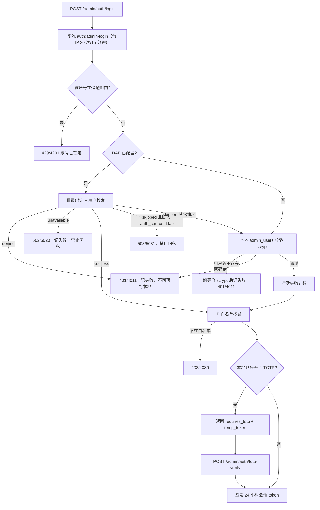

# 管理后台认证

[返回文档中心](README.md)

本文覆盖 `/api/v1/admin/auth/**` 这一组接口：管理员账号、数据库会话、双因素认证、角色权限、
IP 白名单、操作审计和 LDAP/SSO 对接。代码位于 `src/admin-auth/` 和 `src/ldap/`。

普通用户的注册登录见 [03-api-contracts.md](03-api-contracts.md) 的“认证接口”一节；本文只讲**管理端**。

## 1. 唯一的凭据：管理员会话

后台只有一种管理凭据：

| 凭据 | 头部 | 用途 | 是否可写外键 |
| --- | --- | --- | --- |
| 管理员会话 | `Authorization: Bearer <token>` | 登录后签发，可审计到具体人、可撤销、可 2FA | 是 |

**`X-Admin-Token` 静态兼容通道已整体移除**，`ADMIN_TOKEN` 环境变量、`AppConfigService.adminToken`
字段、`AdminAuthGuard` 里的兼容分支、前端 `api.ts` 里按令牌长度选头部的逻辑，全部不再存在。

移除的理由是它同时绕过了四道控制，而且合成的是固定的 `super_admin` 身份：

- **绕过 2FA** —— 静态令牌直接换到全权限，TOTP 形同虚设。
- **绕过 IP 白名单** —— 白名单只在会话路径上校验。
- **绕过会话撤销** —— 改密码、禁用账号都撤不掉这把钥匙，只能改环境变量并重启。
- **绕过审计归属** —— 它合成的身份 `id = 0` 在 `admin_users` 里没有对应行，所有操作都记成
  「无归属」，出了事查不到人。

现在所有管理接口（`/api/v1/admin/auth/**`、`/api/v1/app/admin/**`、`/api/v1/desktop/admin/**`）
都只认登录后签发的会话令牌，用的是同一个 `AdminAuthGuard`。

> **`AdminTokenGuard` 早已删除。** `common/guards/admin-token.guard.ts` 曾经只认 `X-Admin-Token`
> 且在 `ADMIN_TOKEN` 为空时一律拒绝，但全项目没有任何 `@UseGuards` 或模块引用它，是纯死代码。
> 历史文档把它写成“发布接口的守卫”是错的；实际生效的一律是 `AdminAuthGuard`。要判断某个守卫是否
> 生效，`grep` 它在 `@UseGuards` 里的实际引用，不要靠文件名或旧文档推断。

### 桌面发布脚本怎么拿凭据

`desktopApp/build.gradle.kts` 的 `publishDesktopRelease` 任务原先带静态令牌，现在读环境变量
`ADMIN_SESSION_TOKEN`，并以 `Authorization: Bearer` 发送。取法是在管理后台登录一次，从浏览器
`localStorage.taotao_admin_token` 里取出会话令牌 —— 它 24 小时过期，正好适合一次发布操作。

### 数据库里为什么还允许 `admin_id` 为空

`admin_audit_log.admin_id` 仍是可空列、仍是 `ON DELETE SET NULL`：管理员被删除后，他的历史审计
记录必须保留为「无归属」，而不是被连带删掉。`auditActorId()` 仍保留，作用从「把兼容身份的
`id = 0` 折成 `null`」变成**防御性收敛** —— 身份缺失或 `id` 不是正整数时一律写 `null`，
不让非法值撞外键。

## 2. 登录链路



几个刻意的设计：

- **LDAP `denied` 不回落本地。** 目录明确说“这个人密码错”或“这个人被禁用”时，再去本地
  撞一次密码等于给攻击者多一次机会，也会让被禁用的人靠同名本地账号复活。
- **LDAP `unavailable` 一律拒绝，不回落。** 这个状态表示**目录已经用用户 DN 绑定成功**，
  只是之后的取组/角色映射/同步失败 —— 身份其实已经确认过了。此时回落到本地口令，正好给
  「目录里已停用、但本地还留着旧哈希」的账号开了一条后门。
- **`skipped` 只在账号未被目录接管时才回落。** 目录不可达、没配 LDAP、目录里没这个人，都回落到
  本地密码，这样 LDAP 配错或目录宕机时本地超管还能进后台救场。但账号的 `auth_source = 'ldap'`
  时不允许回落，否则「目录判定已停用」在目录抖动时失效。
- **用户名不存在也要跑 scrypt。** `verifyAgainstNothing()` 用假盐消耗与“用户存在但密码错”
  等价的计算量，否则响应时间差一个数量级，等于把管理员用户名送出去。
- **LDAP 账号不叠加本地 TOTP。** 目录已经承担了第二因子，再叠一层会让 LDAP 用户登不进来。
- **开了 TOTP 只发挑战票据，不发会话。** 见下一节。
- **账号维度退避先于一切。** 见下面的「登录失败退避」小节。

密码错误统一返回 401/4011 且提示都是“用户名或密码错误”，不区分账号是否存在。

### 登录失败退避

`auth:admin-login` 的 IP 限流挡不住代理池 —— 换一个出口地址就能对已知的 `admin` 账号继续猜。
所以再加一层**以账号为键**的退避，实现在 `AdminAuthService`（不是 `RateLimitService`，因为它只在
`AppModule` 的 providers 里且未导出，控制器注入不到）：

| 项 | 值 |
| --- | --- |
| 触发阈值 | 连续失败 5 次 |
| 第 1 轮退避 | 5 分钟 |
| 升级方式 | 每多一轮翻倍：5 → 10 → 20 → 30 分钟封顶 |
| 错误码 | **429/4291**（`ApiErrors.accountLocked()`） |
| 计数清零 | 登录成功时整条清除 |

两条容易写错的细节：

- **`failures` 与 `lockouts` 必须分开记。** 退避期一过只清 `failures`（让正常管理员重新拿到完整
  额度），保留 `lockouts`（让反复失败的账号下一轮锁更久）。如果退避期一到就把整条记录删掉，
  指数升级永远停在第一档；如果只清 `lockedUntil` 不清 `failures`，被锁过一次之后打错一个字
  就再挨 5 分钟，对正常人也过于苛刻。
- **`lockedUntil` 为 0 表示「还没到阈值」，此时绝不能删条目。** 早期实现把「不在退避期」等同于
  「清理历史计数」，结果是每次登录都清零，阈值永远达不到 —— 退避看起来实现了，实际完全没生效。

**4291 与 4290 必须分开。** 4290 是来源地址限流（换 IP 或等窗口过去就恢复），4291 是账号被锁
（换 IP 无用，必须等退避走完）。共用一个码的话，运维和客户端都分不清该换网络还是该等锁，
契约脚本也写不出有意义的断言 —— 它会在账号退避完全没生效时因为 IP 限流先命中而变绿。

## 3. 双因素认证（TOTP）

开启 TOTP 的本地账号走两步：

```text
第一步 POST /admin/auth/login
  → 密码正确且 totp_enabled = 1
  → 响应 { requires_totp: true, temp_token: "...", admin_id: 1 }
  → 不签发会话

第二步 POST /admin/auth/totp-verify
  → 请求体 { temp_token: "...", token: "123456" }
  → 核销票据 → 校验动态码 → 才签发正式会话
```

`temp_token` 是**必需**字段，这是 2FA 能不能成立的关键：

- 没有它，任何知道 `admin_id` 的人都能跳过密码直接进第二步猜 6 位码，2FA 形同虚设。
- 票据 32 字节随机、**5 分钟**过期、**用后即焚**（`consumeTotpChallenge` 无论后续校验成败都
  先删除），所以同一张票无法反复试码。
- 票据存进程内存 `Map`，不落库。重启即失效是期望行为，和限流器一样不跨实例共享。
- 第二步会重新读账号并检查 `disabled_at` / `totp_enabled` / `totp_secret`，禁用或已关 2FA 的
  账号不能靠旧票据拿到会话。
- 请求体里如果带了 `admin_id`，必须与票据绑定的 `admin_id` 一致，防止拿别人的票据试探。

动态码必须是 6 位纯数字（`/^\d{6}$/` 前置拦截），校验窗口为 `window: 1`（前后各一个时间片），
TOTP 发行者名称由 `TOTP_ISSUER` 配置，默认“桃桃音乐管理后台”。

> **TOTP 算法是自实现的，不再依赖 `speakeasy`。** 实现位于 `src/admin-auth/totp.ts`
> （`base32Encode` / `base32Decode` / `hotp` / `totp` / `verifyTotpCode` / `generateTotpSecret`），
> 移除依赖是因为 `speakeasy@^2` 已停止维护，而它正好是校验第二因子的那段代码。
> 库里已存的 base32 密钥无需迁移：解码逻辑与 RFC 4648 一致，`otpauth://` URL 的格式也保持不变。
> 用 `npm run verify:totp` 校验（RFC 4226 附录 D + RFC 6238 附录 B 向量、窗口边界，36 项）。

管理接口：

| 路径 | 行为 |
| --- | --- |
| `POST /admin/auth/totp-enable` | 校验当前密码后生成密钥，返回 `secret` 和 `otpauth_url`；此时尚未启用 |
| `POST /admin/auth/totp-confirm` | 用一次真实动态码确认，通过后 `totp_enabled = 1` |
| `POST /admin/auth/totp-disable` | 校验当前密码后关闭并清空密钥 |

`totp-enable` 到 `totp-confirm` 之间是“已生成密钥但未启用”的中间态，此时登录仍然不需要动态码。

## 4. 角色与权限

三种角色，定义在 `admin_users.role` 的 CHECK 约束里。权限分成三块：**后台自身**（管理员账号、
审计日志、IP 白名单）、**个人数据**（用户资料与听歌历史）、**业务管理接口**（发布、Windows
发布、公告、图片 Key）：

| 角色 | 后台自身 | 个人数据 | 业务管理接口 |
| --- | --- | --- | --- |
| `super_admin` | 全部（含管理员增删改、IP 白名单） | 读 | 读写 |
| `admin` | 读管理员列表与审计日志 | 读 | 读写 |
| `viewer` | 无 | **无** | 读，写操作 403/4030 |

分组常量集中在 `admin-roles.ts`，不要在控制器里手写角色数组：

| 常量 | 取值 | 用途 |
| --- | --- | --- |
| `ADMIN_ROLES` | `super_admin` / `admin` / `viewer` | 创建管理员时的合法角色集合 |
| `READ_ROLES` | 三种角色 | 业务管理接口的读接口 |
| `WRITE_ROLES` | `super_admin` / `admin` | 业务管理接口的写接口 |
| `PRIVILEGED_READ_ROLES` | `super_admin` / `admin` | 后台自身 + 个人数据的读接口 |

`READ_ROLES` 与 `PRIVILEGED_READ_ROLES` 必须分开。后者覆盖四处：

- **审计日志**会暴露「谁在什么时候改了什么」。
- **管理员列表**会带出 `ip_whitelist` 与 `last_login_ip`。
- **用户接口**返回的是个人数据：`GET /app/admin/users` 带 `email` 与听歌统计，
  `GET /app/admin/users/:id/playback` 带逐首歌的播放次数和时间戳。
- **音源账号清单**会带出音源账号的凭据状态与手机号掩码。

观察者能进后台是为了看发布状态这类运营数据，不是来看别人的个人信息和操作记录。
`/app/admin/users` 下的**读写**都要求 `admin` 及以上，前端「用户与统计」页签对观察者隐藏。

`RolesGuard` 读 `@RequireRole(...)` 元数据：

- 方法或类上**没有** `@RequireRole` → 放行（只要求已认证）。**所以漏标等于没有权限校验，
  而且不会报错**——这是这套机制最容易出事的地方。
- 有标注但不满足 → 403/4030，消息里带上需要的角色名。
- 完全没有身份 → 401/4013。

`super_admin` 在 `RolesGuard` 里直接放行，不必逐个接口列出。

`RolesGuard` 抛异常而不是返回 `false`。返回 `false` 会被 Nest 变成 403 且不带业务码，客户端
拿不到可判断的错误码；抛 `ApiErrors` 才能落到统一信封里。

非超管调用 `GET /admin/auth/users` 时，`trimAdminRow()` 会裁掉 `ip_whitelist` 和
`last_login_ip` 两列。这不是显示优化，而是防止普通管理员读到别人的网络位置。

写操作有三条自保护规则，都会返回 400/4000：

- 不能降级或禁用当前登录的账号。
- 不能删除自己。
- 不能降级、禁用或删除**最后一个**在用的超级管理员（`assertNotLastSuperAdmin`）。

## 5. IP 白名单与客户端取址

`admin_users.ip_whitelist` 是可空文本列，按换行/逗号分隔存一组 IP。为空表示不限制；非空时
`assertIpAllowed()` 要求当前请求来源命中其中一项，否则 403/4030“当前 IP 不在白名单中”。

登录链路和 2FA 第二步都会校验白名单，所以伪造票据也无法绕过。

**取址是这套机制唯一的软肋。** `X-Forwarded-For` 是客户端可写的请求头，无条件采信它等于
把白名单变成摆设。因此：

```text
TRUST_PROXY 未设置或不是 1/true
  → 用 socket.remoteAddress，忽略 X-Forwarded-For

TRUST_PROXY=1 或 true
  → 取 X-Forwarded-For 的第一个值
```

只有确实部署在可信反向代理之后才设 `TRUST_PROXY=1`，并且代理必须自己覆写而不是追加
`X-Forwarded-For`。直接暴露到公网时保持默认关闭。

当前白名单只做**精确字符串匹配**：不支持 CIDR 网段，也不做 `::ffff:192.168.1.1` 这类
IPv4-mapped 前缀的归一化。写白名单时要填写服务端实际看到的地址格式。

## 6. 操作审计

`admin_audit_log` 记录 `action`、`target_type`、`target_id`、`detail`、`ip_address`、`user_agent`
和 `created_at`。`detail` 是 JSON 字符串，只放结构化摘要，不放长文本（例如公告正文不入审计）。

后台自身的 action：

| action | 触发点 |
| --- | --- |
| `auth.login` | 本地密码登录成功 |
| `auth.login_ldap` | LDAP 登录成功 |
| `auth.login_totp` | 通过 TOTP 第二步登录成功 |
| `auth.change_password` | 修改自己的密码 |
| `auth.totp_enable_requested` | 生成 2FA 密钥（尚未启用） |
| `auth.totp_enabled` | 动态码校验通过，2FA 正式生效 |
| `auth.totp_disabled` | 关闭 2FA |
| `admin.create` / `admin.update` / `admin.delete` | 管理员增删改 |
| `admin.ip_whitelist` | 修改 IP 白名单 |

业务管理接口的 action（`target_type` 见括号）：

| action | 触发点 |
| --- | --- |
| `release.publish` / `release.rollout` / `release.min_version` | Android 发版、放量、抬高下限（`release`） |
| `release.patch_publish` / `release.patch_rollout` | 热修复补丁登记与放量（`patch`） |
| `release.config_set` / `release.config_remove` | 远端配置写入与删除（`remote_config`） |
| `desktop.artifact_upload` | 上传 Windows 模块（`desktop_artifact`） |
| `desktop.publish` / `desktop.rollout` / `desktop.min_version` | Windows 发布、放量、抬高下限（`desktop_release`） |
| `announcement.create` / `update` / `set_enabled` / `set_pinned` / `delete` | 公告生命周期（`announcement`） |
| `user.set_disabled` / `user.delete` | 禁用与删除普通用户（`user`） |
| `image_key.import` / `image_key.delete` | 图片 Key 导入与删除（`image_key`） |
| `open_api_key.create` / `set_enabled` / `revoke` | 开放 API Key 生命周期（`open_api_key`，只记 `keyPrefix`） |
| `music_source.create` / `update` / `enable` / `disable` / `probe` / `delete` | 音源账号生命周期（`music_source_account`） |
| `music_source.sms` / `music_source.login` | 音源短信与登录；`sms` 的 `target_id` 为空、只记掩码手机号 |

注意 `logout` **不写审计** —— 退出接口没有凭据也能调用，记一条没有操作人的记录没有意义。

业务控制器不要直接注入 `AuditLogRepository`，用 `AdminAuditService`：

```ts
await this.audit.record(request, "release.rollout", "release", `${channel}#${body.versionCode}`, {
  channel, versionCode: body.versionCode, percent, enabled: body.enabled,
});
```

它统一处理两件事：把非法/缺失的操作人 id 收敛成 `null`（不让它撞 `admin_users` 外键），以及
只在 `TRUST_PROXY` 开启时才采信 `X-Forwarded-For`。**只在操作成功之后调用** —— 控制器
抛异常时这行不会执行，审计记的是「发生了什么」，不是「尝试了什么」。

图片 Key 的审计只记 `maskedKey`，明文连审计表也不落。

`GET /admin/auth/audit-log` 支持 `adminId`、`action`、`limit` 查询参数，按时间倒序返回。
`admin_id` 为 `null` 表示**原管理员已被删除**（外键是 `ON DELETE SET NULL`，历史审计必须保留），
这是当前唯一会产生无归属记录的原因。

### 审计日志界面（中文化）

`AuditLogViewer.vue` 负责把库里「域名.动作」式的英文 action 翻译成中文展示：

- `ACTION_GROUPS` 按域分组（登录与账号 / 管理员 / 公告 / 客户端版本 / 桌面版本 / 音源账号 /
  密钥 / 用户），既是筛选下拉的数据源，也派生出整张动作名翻译表；未收录的 action 回退显示原文。
- `TARGET_TYPE_LABELS` 翻译 `target_type`（如 `music_source_account` → 音源账号）。
- `DETAIL_KEY_LABELS` / `DETAIL_VALUE_LABELS` 把 `detail` JSON 还原成「中文键名：中文值」
  一行文本（布尔转是/否、字节数转 MB、放量加 %），非法 JSON 原样展示。

**维护规则：后端新增审计 action 时，必须同步在前端 `ACTION_GROUPS` 补一行**，否则界面上
只会显示英文原文。`actionTag()` 按 delete/revoke/remove/disable 等关键词上色，新动作自然落入
默认样式，无需单独登记。

**审计写入失败不能把主流程带崩。** 登录、改密码这些操作先完成业务动作再写日志；日志表故障时
应该只影响审计完整性，不应该让管理员登不进来。

## 7. 路由表

所有路径都要加 `/api/v1` 前缀。`@AdminGuarded()` = `AdminAuthGuard` + `RolesGuard`。

| 方法 | 路径 | 鉴权 | 最低角色 |
| --- | --- | --- | --- |
| `POST` | `/admin/auth/login` | 公开 | — |
| `POST` | `/admin/auth/totp-verify` | 公开（需 `temp_token`） | — |
| `POST` | `/admin/auth/logout` | 公开（无凭据时静默成功） | — |
| `GET` | `/admin/auth/me` | `@AdminGuarded()` | 任意已认证角色 |
| `POST` | `/admin/auth/change-password` | `@AdminGuarded()` | 任意已认证角色 |
| `POST` | `/admin/auth/totp-enable` | `@AdminGuarded()` | 任意已认证角色 |
| `POST` | `/admin/auth/totp-confirm` | `@AdminGuarded()` | 任意已认证角色 |
| `POST` | `/admin/auth/totp-disable` | `@AdminGuarded()` | 任意已认证角色 |
| `GET` | `/admin/auth/users` | `@AdminGuarded()` | `super_admin` / `admin` |
| `POST` | `/admin/auth/users` | `@AdminGuarded()` | `super_admin` |
| `PATCH` | `/admin/auth/users/:id` | `@AdminGuarded()` | `super_admin` |
| `DELETE` | `/admin/auth/users/:id` | `@AdminGuarded()` | `super_admin` |
| `GET` | `/admin/auth/audit-log` | `@AdminGuarded()` | `super_admin` / `admin` |
| `GET` | `/admin/auth/ip-whitelist/:adminId` | `@AdminGuarded()` | `super_admin` |
| `POST` | `/admin/auth/ip-whitelist/:adminId` | `@AdminGuarded()` | `super_admin` |

`logout` 虽然不带守卫，但会尝试解析 `Authorization: Bearer` 并撤销对应会话；没有凭据时直接
返回 204，不做任何事 —— 这样退出接口本身不会把用户卡在登录页。

限流分三个独立桶：

| 桶 | 挂载点 | 额度 |
| --- | --- | --- |
| `auth:admin-login` | `POST /admin/auth/login` | **每 IP 30 次/15 分钟** |
| `auth:admin-totp` | `POST /admin/auth/totp-verify`、`totp-enable`、`totp-confirm`、`totp-disable` | 每 IP 10 次/15 分钟 |
| `auth:admin-password` | `POST /admin/auth/change-password` | 每 IP 10 次/15 分钟 |

第一步和第二步分桶，避免密码尝试次数挤占动态码尝试次数；改密码单独一桶，是因为它需要提交当前
密码，同样属于可爆破的凭据校验入口。

`auth:admin-login` 比另外两个宽（30 而非 10），是因为**登录的主防线已经换成账号维度的退避**
（连续失败 5 次即锁，见上文）。IP 桶剩下的职责只是给「同一个出口地址轮着猜很多不同账号」设上界，
而不是限制单个管理员的登录次数 —— 办公室、机房普遍共用一个 NAT 出口，按 10 次收紧会让第二个人
登录就被拦下，运维会误判成密码错误。实现见 `RateLimitService.allowAdminLoginAttempt()`。

### 业务管理接口

`/app/admin/**` 与 `/desktop/admin/**` 不在本控制器里，但用的是同一套守卫与角色常量：

| 域 | 路径前缀 | 读 | 写 |
| --- | --- | --- | --- |
| Android 发布 | `/app/admin`（releases、rollout、min-version、config、patches、patch-rollout） | `READ_ROLES` | `WRITE_ROLES` |
| Windows 发布 | `/desktop/admin`（releases、artifacts、rollout、min-version） | `READ_ROLES` | `WRITE_ROLES` |
| 公告 | `/app/admin/announcements` | `READ_ROLES` | `WRITE_ROLES` |
| 图片 Key | `/app/admin/image-keys` | `READ_ROLES` | `WRITE_ROLES` |
| 开放 API Key | `/app/admin/open-api-keys` | `READ_ROLES` | `WRITE_ROLES` |
| 音源账号 | `/app/admin/music-sources*`（清单、可用项、增删改、启停、探测、短信、登录） | 清单 `PRIVILEGED_READ_ROLES`（凭据属个人信息），其余 `READ_ROLES` | `WRITE_ROLES` |
| 用户 | `/app/admin/users` | `PRIVILEGED_READ_ROLES` | `WRITE_ROLES` |

**守卫一律逐个方法挂，任何控制器都不例外。** 早期文档把守卫的挂法分成两类（「全是管理接口的
控制器挂类上、含公开路由的逐个方法挂」），这个区分已经废弃：类级守卫在「将来给这个控制器加一个
公开路由」时会静默出错，而维护者不会记得去改类级装饰器。统一用 `@AdminGuarded()` 之后，
「这个路由受不受保护」在方法上一眼可见。

`AnnouncementController` 同时有公开的 `GET /announcements`（客户端首页要用），它是最早被迫
逐个方法挂的那个；现在其余四个控制器也统一成同样的写法。

## 8. 数据模型

三张表，详见 [04-database.md](04-database.md) 的同名小节：

- `admin_users`：账号、scrypt 口令、角色、TOTP 密钥、IP 白名单、登录痕迹、禁用时间，以及
  `must_change_password`（首次登录必须改密）与 `auth_source`（`local` / `ldap`）。
- `admin_sessions`：会话 token 的 SHA-256 哈希、过期时间、撤销时间、登录 IP 和 UA。
- `admin_audit_log`：操作审计，`admin_id` 可空且 `ON DELETE SET NULL`。

会话 token 是 48 字节随机值的 base64url 编码，**只存哈希**，有效期 24 小时。
`validateSession()` 每次都会回表确认管理员未被禁用，所以禁用账号能立刻生效，不用等会话过期。

改密码会撤销该管理员的**其它**会话，保留当前这条：接口返回 204，前端不会跳登录页，把本人
踢下线体验很差；但放着其它设备不管又不安全。

`auth_source` 有两个作用：一是登录时判断「这个账号是否已被目录接管」（决定目录不可用时能不能
回落本地口令），二是把 LDAP 同步进来的账号与本地账号区分开。`LdapService.syncToLocal()`
在首次同步时写入 `'ldap'`，存量账号在下一次登录时补齐标记。

## 9. 启动期四个硬约束

这四条都不是类型错误，`tsc` 和静态审计都发现不了，只有真正把服务跑起来才会暴露。前三条曾经
同时存在，导致整个后台无法登录；第四条是后来补的强制改密链路。

### 9.1 不能把 `@UseGuards` 挂在控制器类上

```typescript
// 错误：类级守卫对 login 同样生效
@UseGuards(AdminAuthGuard, RolesGuard)
@Controller("admin/auth")
export class AdminAuthController {}

// 正确：共享的方法级装饰器（src/admin-auth/admin-guarded.decorator.ts）
@AdminGuarded()
@Post("login")
```

登录时用户手里还没有凭据，类级守卫会让**所有**登录请求先被自己的守卫 401 掉，表现为
`/admin/auth/login` 恒返回 401/4013，谁也进不去。

新增受保护方法时用 `@AdminGuarded()`，不要图省事把它挪到类上。装饰器本身也**只能**挂在方法上
—— `admin-guarded.decorator.ts` 的注释里写明了理由，改动它之前先读一遍。

### 9.2 用到 `AdminAuthGuard` 的模块必须导入 `AdminAuthModule`

Nest 在**声明 Controller 的模块**里解析守卫的依赖。某个模块用了 `AdminAuthGuard` 却没导入
`AdminAuthModule`，启动时会抛：

```text
UnknownDependenciesException: Nest can't resolve dependencies of the AdminAuthGuard (?)
```

这是启动致命错误，进程直接起不来。新增模块引用管理守卫时，记得把 `AdminAuthModule` 加进
`imports`。`ImageGenerationModule` 就踩过这个坑。

同理，业务控制器要写审计就得注入 `AdminAuditService`，而它也在 `AdminAuthModule` 里，
所以 `AdminAuthModule` 的 `exports` 必须包含 `AdminAuthService`、`AdminUsersRepository`、
`AdminAuditService` 三个。`RolesGuard` 只依赖 Nest 核心的 `Reflector`（全局可用），不需要导出。

### 9.3 默认管理员必须建在 `onApplicationBootstrap`

`DatabaseService` 的迁移跑在 `onModuleInit`，而 `main.ts` 里的代码在两个钩子**之前**执行。
把默认管理员创建写在 `main.ts`，会先撞“关系 admin_users 不存在”。

`AdminBootstrapService` 实现 `OnApplicationBootstrap`，在迁移完成后才创建 `admin`（`super_admin`）。
找不到该用户名才创建，已存在则跳过，所以重启幂等。

### 9.4 默认管理员不再有硬编码口令，首次登录强制改密

`admin/admin123` 是公开的默认凭据 —— 任何一次「部署完忘了改密码」都等于把后台挂在公网上。
现在初始口令有两个来源，二选一：

| `ADMIN_INITIAL_PASSWORD` | 初始口令 | 日志行为 |
| --- | --- | --- |
| 已设置（至少 12 字符，否则启动失败） | 取该值 | `LOG` 只写「口令取自环境变量」，**不打印明文** |
| 未设置 | `randomBytes(32).toString("base64url")` | `WARN` 打印一次明文，并提示设置环境变量 |

无论哪种来源，创建的账号都带 `must_change_password = 1`。`AdminAuthGuard` 据此拦截：
该标志为 1 时，除标了 `@AllowPendingPasswordChange()` 的 `me` 与 `change-password` 外，
**一律 403/4031**「首次登录必须先修改初始密码」。

几个必须保持的点：

- **拦截放在守卫里，不放在控制器辅助函数里。** 业务控制器只通过 `audit.record(request, ...)`
  使用 `request.adminUser`，不调用任何控制器内的取身份方法 —— 只有放守卫里才能覆盖全部当前与
  未来的管理路由。
- **改密的放行必须显式标注。** `@AllowPendingPasswordChange()` 是白名单，默认拒绝。
  新增「待改密状态下也要能用」的接口时才会去标它。
- **`updatePassword()` 顺带清标志，且在一条 SQL 里完成。** 分两步写会出现「密码已改但标志还在」
  的中间态，用户改完密码仍然被 4031 挡在门外，只能靠重启或手工改库救。
- **前端 `ForcePasswordChange.vue` 是独立全屏组件**，在 `App.vue` 里优先于后台主体渲染。
  登录响应里的 `must_change_password` 为 `true` 时直接进入它，不给出任何绕过入口。

`me` 与 `change-password` 的响应都用 `publicAdmin()` 收敛成
`{ id, username, display_name, role, must_change_password }`，不要把 `AdminUserRecord`
整条丢出去 —— 那会带上 `password_hash` 与 `totp_secret`。

## 10. 前端管理后台

Vue 管理后台在 `src/frontend/`，构建产物输出到 `dist/public`，由 Nest 挂在 `/admin/`。

- `AdminLogin.vue`：两步登录。第一步失败清空凭据；第二步 `temp_token` 失效时清空票据并退回
  第一步，而不是停在动态码输入框反复失败。
- `ForcePasswordChange.vue`：`must_change_password` 为真时的全屏强制改密页，在 `App.vue`
  里优先于后台主体渲染，没有跳过入口。
- `AdminUserManager.vue`、`AuditLogViewer.vue`、`IpWhitelistManager.vue` 调用 `/admin/auth/**` 下的路径；
  业务管理页 `ReleaseManager.vue`、`PatchManager.vue`、`DesktopReleaseManager.vue`、
  `AnnouncementManager.vue`、`UserManager.vue`、`MusicSourceManager.vue`、`OpenApiKeyManager.vue`、
  `SupporterKeyManager.vue`（图片 Key 管理页）各自调用对应 `/app/admin/**`、`/desktop/admin/**`
  路径。改后端路由时必须同步对应组件，否则页面表现为 404/4040。

注意 `IpWhitelistManager.vue` 当前没有任何页面引用它，是孤儿组件。

`api.ts` 的 `authHeaders()` 现在**恒定返回 `Authorization: Bearer`**，不再按令牌长度猜头部
（那个判断随兼容通道一起删掉了）。`adminChangePassword()` 是给强制改密页用的。

### 安全响应头

`/admin` 下的所有响应（含 `express.static` 直接吐出的 JS/CSS）都带 CSP，由 `main.ts` 的
Express 中间件下发，**必须挂在 `expressStatic` 之前**：

```text
default-src 'self'; script-src 'self'; style-src 'self' 'unsafe-inline';
img-src 'self' data: blob: https:; font-src 'self' data:; connect-src 'self';
object-src 'none'; base-uri 'self'; form-action 'self'; frame-ancestors 'none'
```

- 用中间件而不是 Nest 拦截器：静态资源在路由之前就被 `express.static` 吐出去了，拦截器根本
  没机会运行，而 CSP 必须跟着 `index.html` 一起下发。
- `style-src` 是本策略唯一放宽的一项（Element Plus 以行内样式注入主题变量），`script-src`
  保持严格 —— 因此**主题预置脚本已外置**成 `src/frontend/public/theme-bootstrap.js`。
  它必须是同步阻塞脚本（不加 `defer`/`async`），否则会晚于首屏渲染，暗色模式闪烁会回来。
- 只作用于 `/admin`：分享页是 Kotlin/Wasm，编译 WebAssembly 需要 `wasm-unsafe-eval`，
  套用这份策略会直接把播放器打瘫。

## 11. 验证

管理后台认证的契约断言在 `tools/verify-contract.mjs`，相关段落有四个：

1. **「管理端会话准备：强制改密与 Bearer 会话」**（必须在所有管理端断言之前跑）：用
   `ADMIN_INITIAL_PASSWORD` 首次登录 → 断言 `must_change_password === true` → 断言改密前访问
   其它管理接口是 403/4031 → 改密 204 → 新口令重登成功且不再要求改密 → 初始口令失效 4011。
2. **「管理路由逐条无凭据探测」**：枚举脚本内 `guardedAdminRoutes` 清单的全部受保护管理路由
   （随音源账号、开放 Key 等新模块增长，当前约 48 条，以脚本清单为准），逐条断言无凭据时返回
   **401/4013**；再断言 4 条公开路由不会被管理员守卫拦下。期望 4013 而不是 4010 是有意的：
   4013 说明 `AdminAuthGuard` 确实跑了，若有人把 `@Public()` 摘掉，全局访问令牌守卫会抢先
   返回 4010，断言同样会失败。
3. **「管理后台认证：账号 / 角色 / 2FA / 审计」**：匿名 4013、密码错 4011、超管登录、`/me`、
   管理员列表、审计日志、缺/伪造 `temp_token` 均 4011、**已移除的 `X-Admin-Token` 通道不再被
   接受**、伪造 `X-Forwarded-For` 被白名单拒、创建管理员 201、viewer 读列表 403/4030、
   viewer 提权 403/4030、`PATCH` 局部更新、**账号退避 429/4291 且不影响其它账号**、
   不能禁用最后一个超管 400/4000、删除管理员 204。
4. **「业务管理接口：角色校验与审计」**：viewer 对发布放量、Windows 放量、禁用用户、发布公告、
   导入图片 Key 五个写接口一律 403/4030；发布、Windows 发布、公告、图片 Key 四个域的读接口对
   viewer 返回 200（不能顺手把只读账号锁死）；**用户列表与听歌历史对 viewer 返回 403/4030，
   对 `admin` 返回 200/404**；`admin` 角色能发布公告；该公告在 `admin_audit_log` 里查得到且
   `admin_id` 记的是发布者本人。另有「音源账号（后台）与酷我音源接入」「单曲倒带日记」等新段落
   覆盖音源账号的角色边界（viewer 读清单 403/4030）与日记接口契约。

另有「安全响应头与跨域」一节断言 CSP 与 CORS，以及「头像上传：按文件头判定格式」一节断言
上传的魔数校验（见 [03-api-contracts.md](03-api-contracts.md)）。

运行方式和数据库准备见 [00-code-index.md](00-code-index.md) 与 [02-development.md](02-development.md)。
契约脚本是有状态的，必须“重置验证库 → 重启服务 → 单次运行”，并且启动时必须显式给
`ADMIN_INITIAL_PASSWORD`（否则拿不到管理会话，后面所有管理端断言会连锁失败）。

## 12. 已知限制

- `temp_token` 存进程内存，多实例部署时第二步可能落到没有票据的那个实例上。
- 登录失败退避也是**进程内 Map**：多实例部署时攻击者可以在实例之间分摊失败次数。
  与限流、2FA 票据同属「单实例假设」，见 [01-architecture.md](01-architecture.md)。
- IP 白名单只支持精确匹配，不支持 CIDR，也不归一化 IPv4-mapped 地址。
- `admin_users.email` 列在界面上没有编辑入口（后端已支持）。
- 前端的写按钮没有按角色隐藏：观察者打开发布、公告、设置页仍能看到按钮，点了才会收到 403。
  服务端是权威，但交互上可以再收敛。**例外是「用户与统计」**——该页签对观察者隐藏，
  因为它对应的读接口本身就不放行，留着只会点进一片报错。
- 审计写入与业务操作不在同一个事务里：先做业务、后写日志。日志表故障时接口会报错，
  但业务动作已经生效，客户端重试可能造成重复操作。
- `admin_audit_log` 没有留存或归档策略，全部管理端写操作（业务域加后台自身共 30+ 个 action）
  持续写入，表只增不减。
- 退避只按账号计数，不按「账号 + 来源地址」：同一 NAT 出口下的其它管理员不受影响，
  但一个被锁的账号会让所有试图登录它的人一起等 —— 这是有意的取舍（防止换 IP 绕过）。
